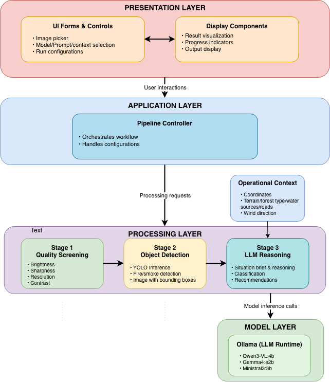
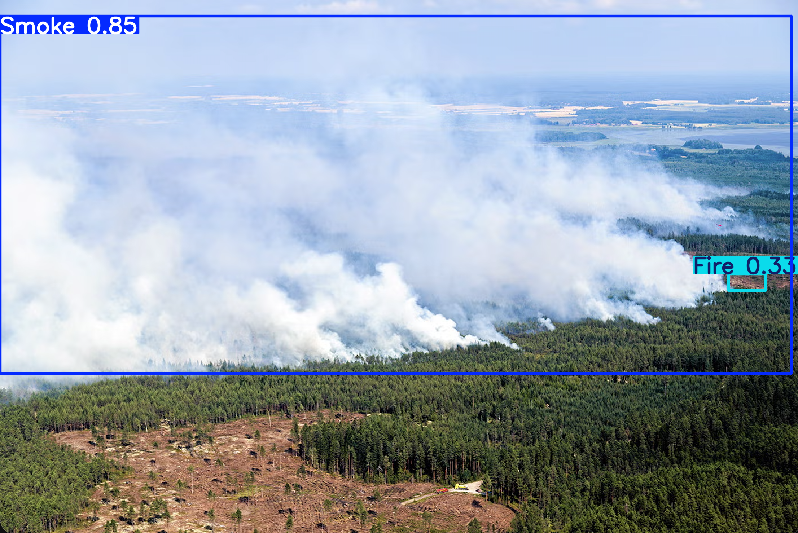
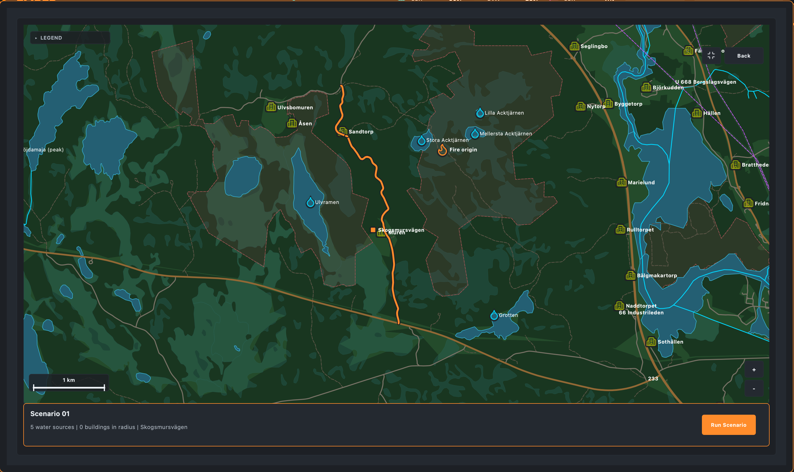
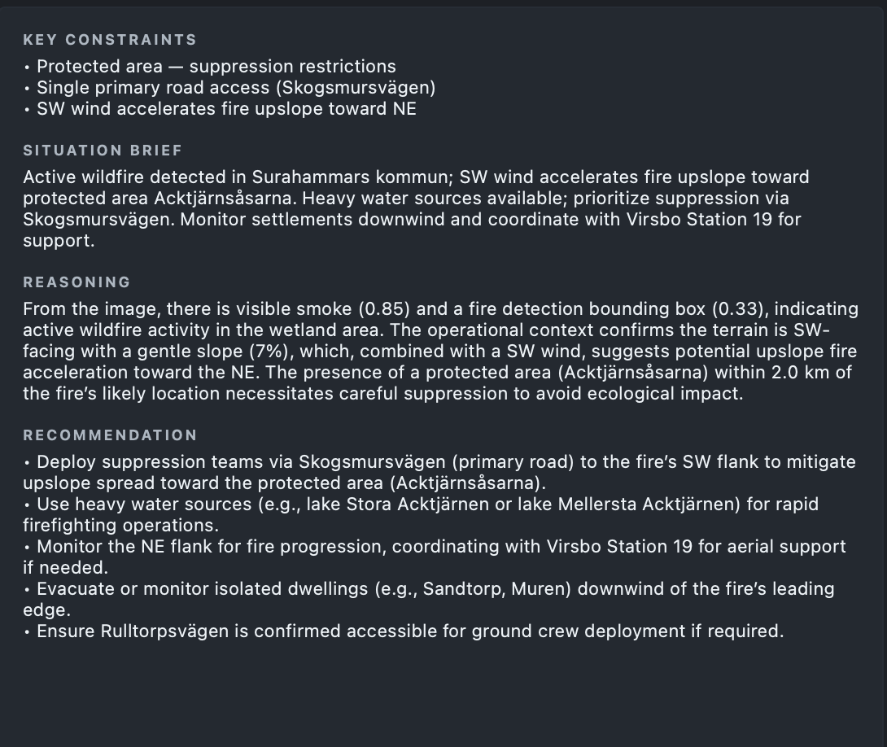

# EMBER: Edge-Deployed Multimodal LLMs for Wildfire Detection and Decision Support

Bachelor thesis project evaluating whether compact multimodal language models can support wildfire detection and operational decision-making on local hardware.

EMBER stands for Edge-deployed Multimodal Burning Environment Reconnaissance.

The project combines image quality screening, YOLO fire/smoke detection, GIS-derived operational context, structured multimodal LLM reasoning, benchmarking, and a PySide6 desktop interface into one research-engineering pipeline.



## Project Highlights

- Local-first wildfire decision-support prototype for environments where cloud inference may be unavailable, undesirable, or too slow.
- Edge-deployed multimodal LLM evaluation using compact vision-language models through Ollama.
- Integrated YOLO + GIS + MLLM pipeline for connecting visual detections with operational context.
- Structured benchmark framework for accuracy, performance, scenario evaluation, YOLO preprocessing modes, and context-enabled reasoning.
- PySide6 operational UI for demonstrating end-to-end image processing, model selection, reasoning output, and system monitoring.
- Deployment target focused on consumer hardware rather than server-class GPUs.
- Research-oriented evaluation design grounded in repeatable scenarios, schema-constrained outputs, and comparative model behavior.

## Thesis Context

This repository supports a Bachelor thesis at the University of Gothenburg, developed in collaboration with the Swedish Defence Materiel Administration (FMV).

Developed by Erik Nisbet, Martin Lidgren, Edvin Sanfridsson, Johannes Borg, and Love Carlander Strandäng.

The work follows a Design Science Research methodology: the artifact is a working edge-oriented wildfire decision-support prototype, and the evaluation studies how design choices affect classification behavior, inference performance, and operational usefulness.

The codebase is therefore both a research artifact and an engineering implementation. It is intended to make the thesis reproducible, inspectable, and demonstrable.

This prototype is intended for research and demonstration only and is not validated for operational emergency-response use.

## Table of Contents

- [Project Highlights](#project-highlights)
- [Thesis Context](#thesis-context)
- [Why This Project Exists](#why-this-project-exists)
- [Research Contributions](#research-contributions)
- [What It Does](#what-it-does)
- [System Architecture](#system-architecture)
- [Architecture Decisions](#architecture-decisions)
- [Repository Layout](#repository-layout)
- [Technology Stack](#technology-stack)
- [Quick Start](#quick-start)
- [Running the Pipeline](#running-the-pipeline)
- [Desktop Demo](#desktop-demo)
- [Data and Operational Context](#data-and-operational-context)
- [Benchmarking](#benchmarking)
- [Testing](#testing)
- [Research and Engineering Highlights](#research-and-engineering-highlights)
- [Known Limitations](#known-limitations)
- [GitLab Notes](#gitlab-notes)
- [Project Status](#project-status)

## Why This Project Exists

Wildfire response depends on fast interpretation of uncertain visual evidence.

A camera image may show smoke, fire, haze, darkness, poor resolution, nearby settlements, difficult road access, or limited water supply. The practical question is not only "is there fire?", but also "what should an operator know next?"

This thesis explores that question through a deployable prototype:

- Can small multimodal LLMs classify wildfire imagery reliably enough for decision support?
- Does object-detection preprocessing improve or degrade model behavior?
- Does structured GIS context improve operational reasoning?
- Can the full workflow run locally on edge-capable hardware rather than relying on cloud inference?
- How should outputs be constrained so that model responses are measurable and useful?

The result is a research codebase structured like a product prototype: repeatable runs, modular pipeline stages, scenario fixtures, benchmark outputs, tests, and a demo UI.

## Research Contributions

The thesis contributes an applied evaluation framework for edge-deployed multimodal wildfire decision support.

The main contributions are:

- Comparative evaluation of compact multimodal LLMs for wildfire image classification and decision-support generation.
- GIS-enriched operational reasoning that augments visual input with terrain, water access, roads, settlements, land cover, and wind.
- Structured benchmark methodology for separating model accuracy, inference speed, memory use, model size, YOLO overhead, and context effects.
- YOLO preprocessing support across annotated-image, text-summary, and bounding-box-location input modes, with thesis evaluation focused primarily on YOLO on/off conditions.
- Inference reliability analysis using schema-constrained JSON outputs, timeout handling, cancellation support, and model-specific failure tracking.
- Operational decision-support generation that moves beyond binary classification into reasoning, recommendations, and situation briefs.

## What It Does

The core pipeline processes a wildfire image through four conceptual stages:

| Stage | Purpose | Output |
|---|---|---|
| Quality screening | Reject unusable images before expensive inference | Resolution, brightness, contrast, and sharpness checks |
| Object detection | Detect fire and smoke using local YOLO weights | Bounding boxes, labels, confidence values, optional annotated image |
| Operational context | Add GIS-derived scenario information | Terrain, road access, water sources, settlements, land cover, wind |
| LLM reasoning | Run a local multimodal model through Ollama | Structured JSON with classification, reasoning, recommendation, and brief |

The project supports multiple YOLO-to-LLM integration modes:

- `disabled`: send the original image directly to the LLM.
- `annotated_image`: send a YOLO-annotated image to the LLM.
- `context_summary`: send the original image plus detection labels and confidence values.
- `context_locations`: send the original image plus detection metadata and bounding box coordinates.

The LLM response is validated against a strict schema, which makes outputs usable for accuracy metrics, qualitative review, and UI rendering.

## System Architecture

The reusable orchestration layer lives in [pipeline/service.py](pipeline/service.py). It exposes a `PipelineRunner` that yields stage events, allowing both CLI scripts and the Qt UI to show progress without duplicating stage logic.

```text
Input image
    |
    v
Quality screening
    |
    v
YOLO fire/smoke detection
    |
    +--> annotated image or text detection context
    |
    v
Operational context formatting
    |
    v
Multimodal LLM inference through Ollama
    |
    v
Validated structured decision-support JSON
```

Additional architecture diagrams are available in [architecture/](architecture/).

## Architecture Decisions

The technology choices are deliberately pragmatic: the goal is to evaluate an operationally plausible edge prototype, not only run isolated model experiments.

| Decision | Rationale |
|---|---|
| Ollama for MLLM inference | Provides a local model runtime with simple model management, streaming responses, and structured-output support suitable for repeatable edge experiments. |
| YOLOv8 / Ultralytics for fire-smoke preprocessing | YOLO is fast, well-supported, and practical for object-detection preprocessing on local hardware. It also makes the visual preprocessing stage measurable through detection count, confidence, bounding boxes, and runtime overhead. |
| Local inference first | Wildfire monitoring and critical operations may face connectivity, latency, cost, or data-control constraints. Running models locally makes those deployment constraints explicit. |
| Structured JSON outputs | Schema enforcement turns natural-language model responses into measurable artifacts. This enables benchmark scoring, UI rendering, invalid-output detection, and consistent qualitative review. |
| Modular pipeline stages | Quality screening, object detection, context formatting, and LLM reasoning can be tested, benchmarked, skipped, or replaced independently. |

## Repository Layout

```text
.
+-- architecture/                 # Architecture diagrams used in documentation
+-- benchmarks/                   # Accuracy, performance, scenario evaluation, analysis
|   +-- src/                      # Benchmark helpers for loading, metrics, logging, YOLO
|   +-- results/                  # Local benchmark CSV/JSON outputs
|   +-- BENCHMARKING.md           # Detailed benchmark documentation
+-- data/
|   +-- contexts/                 # Scenario JSON files and paired scenario images
|   +-- gis/                      # OSM extracts and elevation rasters for context generation
+-- dataset/                      # Kaggle dataset download helper
+-- pipeline/
|   +-- context/                  # Operational context schema, extraction, formatting
|   +-- gis/                      # GIS data setup and verification helpers
|   +-- llm/                      # Ollama multimodal inference and prompt versions
|   +-- object_detection/         # YOLO model loading, detection, annotated outputs
|   +-- quality_screening/        # Image quality gates
|   +-- run_pipeline.py           # CLI pipeline entry point
|   +-- service.py                # Shared pipeline orchestration
+-- scripts/                      # Scenario-generation and evaluation helper scripts
+-- ui/                           # PySide6 desktop application
+-- pyproject.toml                # Python project metadata and dependencies
+-- uv.lock                       # Locked dependency graph for uv
```

## Technology Stack

| Area | Tools |
|---|---|
| Language/runtime | Python 3.12 |
| Dependency management | uv |
| Multimodal inference | Ollama, structured JSON output |
| Vision models | Ultralytics YOLO, OpenCV, Pillow |
| LLM models | `ministral-3:3b`, `qwen3-vl:4b`, `gemma4:e2b` by default |
| GIS/context | GeoPandas, PyOgrio, Rasterio, PyProj, Osmium, SRTM elevation data |
| UI | PySide6 |
| Benchmarking | pandas, matplotlib, custom CSV/JSON logging |
| Testing | pytest |

The repository is currently configured for macOS through `uv` environment markers, and the UI/system-monitoring pieces are especially oriented toward Apple Silicon.

## Quick Start

### 1. Install project dependencies

```bash
uv sync
```

For GIS generation and verification on macOS:

```bash
brew install osmium-tool gdal
```

### 2. Install and start Ollama

```bash
brew install ollama
ollama serve
```

In a separate terminal, pull the default thesis models:

```bash
ollama pull ministral-3:3b
ollama pull qwen3-vl:4b
ollama pull gemma4:e2b
```

### 3. Verify the automated test suite

```bash
uv run pytest \
  pipeline/quality_screening/tests \
  pipeline/context/tests \
  pipeline/llm/tests \
  pipeline/object_detection/tests \
  benchmarks/src/tests
```

### 4. Run one end-to-end pipeline example

```bash
uv run python -m pipeline.run_pipeline pipeline/object_detection/test_image.jpg \
  --yolo-model best \
  --llm-model ministral \
  --prompt-file pipeline/llm/prompts/latest.txt \
  --context-json data/contexts/benchmark_scenario.json
```

## Running the Pipeline

The main pipeline CLI is [pipeline/run_pipeline.py](pipeline/run_pipeline.py). Run it from the repository root.

```bash
uv run python -m pipeline.run_pipeline <path/to/image> \
  --yolo-model best \
  --llm-model ministral \
  --prompt-file pipeline/llm/prompts/latest.txt \
  --context-json data/contexts/benchmark_scenario.json \
  --yolo-input-mode annotated_image
```

Useful alternatives:

```bash
# Send YOLO detections as text context instead of drawing boxes on the image
uv run python -m pipeline.run_pipeline <path/to/image> \
  --yolo-input-mode context_summary \
  --prompt-file pipeline/llm/prompts/latest.txt

# Include bounding box coordinates as text
uv run python -m pipeline.run_pipeline <path/to/image> \
  --yolo-input-mode context_locations \
  --prompt-file pipeline/llm/prompts/latest.txt

# Disable YOLO and send the original image to the LLM
uv run python -m pipeline.run_pipeline <path/to/image> \
  --yolo-input-mode disabled \
  --prompt-file pipeline/llm/prompts/latest.txt
```

Stage-specific documentation:

- Quality screening: [pipeline/quality_screening/RUN.md](pipeline/quality_screening/RUN.md)
- Object detection: [pipeline/object_detection/](pipeline/object_detection/)
- LLM inference: [pipeline/llm/LLM_Guide.md](pipeline/llm/LLM_Guide.md)
- Operational context: [pipeline/context/README.md](pipeline/context/README.md)
- GIS setup: [pipeline/gis/README.md](pipeline/gis/README.md)

## Desktop Demo

The UI is a PySide6 desktop application for demonstrating the pipeline interactively.

<!-- Suggested visual placement: full dashboard screenshot or short GIF. -->
<!--  -->

```bash
uv run python ui/main_window.py
```

The app supports:

- Random wildfire test-image selection.
- Quality screening status.
- YOLO-annotated output preview.
- LLM model selection.
- Optional LLM cancellation.
- Operational wind controls.
- In-session history.
- CPU, RAM, and Apple Silicon GPU monitoring.

For GPU percentage in the top bar on macOS, run with administrator privileges:

```bash
sudo uv run python ui/main_window.py
```

See [ui/README.md](ui/README.md) for details.

Recommended README visuals to add when final screenshots are available:

<!-- Suggested visual placement: YOLO annotated image panel. -->
<!--  -->

<!-- Suggested visual placement: operational scenario map. -->
<!--  -->

<!-- Suggested visual placement: LLM reasoning output panel. -->
<!--  -->

- Full dashboard: show the complete operator-facing UI with image preview, model controls, system monitor, and output panels.
- YOLO annotated image: show fire/smoke bounding boxes and confidence values.
- Scenario map: show how geographic context is presented to the user.
- Reasoning output panel: show classification, situation brief, recommendation, and tactical reasoning.

## Data and Operational Context

The project uses three kinds of data:

Large datasets, model weights, benchmark outputs, and generated GIS artifacts are intentionally not committed.

| Data | Location | Notes |
|---|---|---|
| Wildfire image dataset | `dataset/wildfire-dataset/` | Downloaded from Kaggle, gitignored |
| Scenario fixtures | `data/contexts/scenario_*/` | JSON context plus paired image |
| GIS source data | `data/gis/` | OSM extracts and SRTM elevation rasters |

Download the Kaggle wildfire dataset:

```bash
cd dataset
./download.sh
```

Scenario contexts describe operational conditions around a selected coordinate. They include land cover, terrain, nearby water, road access, settlements, natural features, and optional wind.

Regenerate all scenario contexts:

```bash
scripts/generate_context_scenarios.sh --generate-only --mock-wind
```

Regenerate with fixed benchmark wind:

```bash
scripts/generate_context_scenarios.sh --generate-only --benchmark-wind
```

More detail:

- Dataset setup: [dataset/README.md](dataset/README.md)
- Scenario descriptions: [data/contexts/README.md](data/contexts/README.md)
- GIS setup: [pipeline/gis/README.md](pipeline/gis/README.md)

## Benchmarking

Benchmarks are split into statistical accuracy, performance, scenario evaluation, and chart generation.

Run benchmark commands from the [benchmarks/](benchmarks/) directory:

```bash
cd benchmarks
```

Accuracy benchmark:

```bash
uv run python run_benchmark.py accuracy --images ../dataset/wildfire-dataset
```

Balanced sample:

```bash
uv run python run_benchmark.py accuracy \
  --images ../dataset/wildfire-dataset \
  --num-images 100 \
  --seed 42
```

Full Cycle 2 style run with YOLO and operational context:

```bash
uv run python run_benchmark.py accuracy \
  --images ../dataset/wildfire-dataset \
  --with-yolo \
  --with-context
```

Performance benchmark:

```bash
uv run python run_benchmark.py performance \
  --images ../dataset/wildfire-dataset \
  --num-images 5 \
  --cooldown 10 \
  --model-cooldown 90
```

Scenario evaluation:

```bash
uv run python run_scenario_eval.py
uv run python run_scenario_eval.py --with-yolo
uv run python run_scenario_eval.py --scenarios scenario_01 scenario_03
```

Generate charts:

```bash
uv run python analyze.py
uv run python analyze.py --compare-yolo
```

See [benchmarks/BENCHMARKING.md](benchmarks/BENCHMARKING.md) for the full benchmark protocol, output columns, model list, and analysis chart descriptions.

## Testing

Run the automated test suite:

```bash
uv run pytest \
  pipeline/quality_screening/tests \
  pipeline/context/tests \
  pipeline/llm/tests \
  pipeline/object_detection/tests \
  benchmarks/src/tests
```

Run focused tests:

```bash
uv run pytest pipeline/quality_screening/tests -v
uv run pytest pipeline/context/tests -v
uv run pytest pipeline/llm/tests -v
uv run pytest pipeline/object_detection/tests -v
uv run pytest benchmarks/src/tests -v
```

Note: [pipeline/object_detection/test_all_images.py](pipeline/object_detection/test_all_images.py) is a manual YOLO dataset script, not a pytest-style unit test. It expects local weights and dataset paths at import time, so run it deliberately instead of including it in the automated suite.

## Research and Engineering Highlights

This project demonstrates several skills that matter in both research and production software:

- Modular pipeline architecture with independently testable stages.
- Local multimodal inference through Ollama with schema-constrained outputs.
- Practical computer-vision preprocessing using YOLO and OpenCV.
- GIS feature extraction and formatting for operational decision context.
- Benchmark design that separates accuracy, speed, memory use, model size, YOLO overhead, and context conditions.
- Reproducible scenario fixtures for qualitative analysis and stakeholder interviews.
- Desktop UI integration without duplicating pipeline logic.
- GitLab-ready collaboration templates for issues and merge requests.

From a reviewer or recruiter perspective, the strongest signal is not only the use of modern AI tools. It is the way the project turns an ambiguous applied problem into measurable interfaces: validated JSON schemas, explicit benchmark modes, controlled scenario context, repeatable commands, and a UI that exercises the same service layer as the CLI.

## Known Limitations

The project is a research prototype, and the evaluation scope is intentionally bounded.

- Benchmarks are primarily collected on Apple Silicon, so absolute performance numbers should not be generalized to all edge devices without additional hardware runs.
- Evaluation currently uses static images only; temporal consistency, camera streams, video reasoning, and fire progression tracking are not implemented yet.
- Wind context can be mocked for reproducibility, which is useful for controlled comparison but not equivalent to live meteorological integration.
- OSM-derived roads, water sources, settlements, and named features depend on OpenStreetMap completeness in each scenario area.
- Qwen3-VL 4B showed reliability issues in some benchmark conditions, motivating separate failure analysis and cautious interpretation.
- The current system does not yet perform temporal/video reasoning, multi-frame confirmation, sensor fusion, or live alert escalation.

## GitLab Notes

This README belongs in the repository root. GitLab automatically renders it as the project landing page, so it is the right place for the project overview, quick-start commands, architecture summary, and links to deeper docs.

GitLab-specific workflow material should stay separate. This repository already has:

- [.gitlab/issue_templates/Feature.md](.gitlab/issue_templates/Feature.md)
- [.gitlab/issue_templates/Non-feature.md](.gitlab/issue_templates/Non-feature.md)
- [.gitlab/merge_request_templates/Default.md](.gitlab/merge_request_templates/Default.md)

Good future GitLab additions would be:

- `.gitlab-ci.yml` for `uv sync`, `uv run pytest`, and optional linting.
- GitLab Pages or a `/docs` folder if the thesis documentation grows beyond README scope.
- Release notes or tags for final thesis submission artifacts.

## Project Status

This is an active bachelor thesis prototype and research codebase. The main development focus is evaluation quality, scenario realism, and clear evidence for how compact multimodal models behave under wildfire decision-support conditions.

Large local artifacts such as downloaded datasets, benchmark charts, generated outputs, and selected raw GIS downloads are intentionally gitignored. The committed code and scenario fixtures are intended to make the pipeline understandable and reproducible without committing every generated artifact.

## License

This repository is part of a university thesis project. Licensing terms are not yet finalized.

## Attribution

- Wildfire image dataset: [The Wildfire Dataset on Kaggle](https://www.kaggle.com/datasets/elmadafri/the-wildfire-dataset)
- OpenStreetMap data: `OpenStreetMap contributors`, ODbL
- SRTM elevation data: NASA/USGS public domain, commonly attributed as SRTM data courtesy of the U.S. Geological Survey
